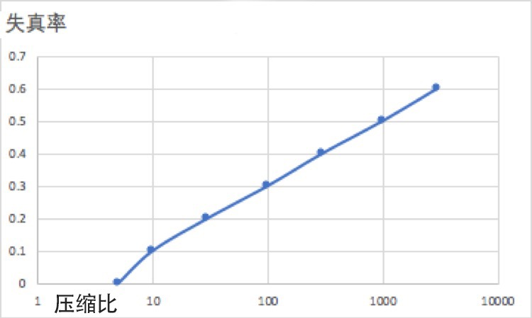

# 0109. 压缩比和失真率：如何在信息取舍之间作平衡？
> 吴军·信息论 40 讲
2019-06-07

上一讲，我们谈论图片和视频是如何压缩的，介绍了它们背后的两个原理：信息的等价性转换，以及利用信息的前后相关性，找出差异，对增量编码。用这些方法，就可以压缩信息。但是大家都有一个疑问，那就是，我压缩过的图片，恢复回来似乎没有原图清晰了，这是怎么回事？信息的压缩是否都会让一部分信息丢失掉？这一讲我会告诉你，信息压缩是要考虑失真率的，而这种取舍平衡的原则，其实是我们都应该学习和了解的。

我们在前面讲了香农第一定律。香农指出，任何编码的长度都不会小于信息熵，也就是通常会大于等于信息熵，当然最理想的就是能等于。如果编码长度太短，小于信息熵，就会出现损失信息的现象。

因此，信息熵是告诉信息处理的人，做事情的边界，就如同不能试图逾越热力学第二定律发明永动机一样，大家在压缩信息时，如果想要无损，就不能逾越香农给的这个边界。也就是说，如果一张图片里面有 10K 的信息，你再怎么压，也不会比它小，否则就会损失信息。

理解了这一点以后，我们就知道无论是语音，还是图像、视频，都有两类的压缩方式，一类就是无损压缩。比如我们昨天说的通过傅里叶变换和离散余弦变换将音频和图像信息变成频率信息，再用类似哈夫曼编码进行压缩，这是不会丢失信息的。

另一类是要丢失一部分信息的，也被称为有损压缩。比如一幅图经过无损压缩已经被压到 10K 了，你还想压到 1K，那就需要有所损失了。因为在很多场合下，有损的压缩还是必要的。

事实上我们今天对于音频、图像和视频的压缩，绝大多数情况都是有损的压缩。而有损压缩最关键的是要清楚如何保证因为压缩而丢失的信息不影响我们对信息的理解呢？这就需要平衡压缩比和信息失真度之间的关系。

所谓失真度，其实通俗来说，就是压缩前、压缩后的两串信息的差的平方。也就是说，如果信息没有任何失真，失真率是 0。如果信息完全消失了，失真率是 100%。有了失真率的概念，我们就可以来讨论有损失的信息压缩了。

其实我们生活中大量应用到的都是有损压缩，只不过我们感受不到，这就说明压缩很好地考虑到了失真率。比如一个数码相机拍的照片，原图有 18MB 的大小。通常 JPEG 算法会将它压缩到 3～5MB，这其实会有信息损失，但是肉眼根本看不出的。你将它印成 10x8 寸的照片，只要你拍得清晰，每一个像素基本上都是清晰的。但是如果你将它压缩到 500K，再印成一样大小的照片，就能看出一个个小色块了，而且一些细节也消失了。

同样的道理，如果我们将原始的语音压缩 10 倍，或许有失真，但是语音本身肯定是清晰的，还能听出是谁的声音，但是如果压缩 50 倍，语音内容可以辨认，但是却听不出是谁的声音了。

那么到底该压缩多少倍呢？接下来我就要为你介绍，压缩比和失真率平衡原则。

在进行信息压缩之前，明确压缩的目的非常重要，你印一张证件照，图片压缩到 100K 也是可以接受的，你要做一张会展的海报，那就还是用原始文件比较好，不要做有损压缩了。通常，压缩比和失真率的关系会是下面这样一条曲线：

在图中表示压缩比的横轴采用的是对数坐标，往右移动一格代表增加一格数量级

很多时候，我们都是在接受了某个失真度的情况下（也就是在上图中横着切一刀），然后再去尽可能找到好的压缩比。世界上很多时候没有最好的技术方案，只能根据场景找到合适的，因此做事的目的性很重要。这是第一个原则。

我们还知道信息的作用是消除不确定性，那么反过来，丢失了一部分信息，一定会增加不确定性。用的信息少，永远不可能做得和原来一样好，这是第二个原则，大家一定要记清楚。

不久前，有一个 YC 的创业团队，介绍他们如何只利用别人 1/1000 的数据就可以进行深度学习的训练。有些投资人问我是否值得投资。我就对他们讲，丢失了 1000 倍的信息，不要指望做出来的东西和以前一样好。

至于如何平衡数据量和效果的关系，就看矛盾的主要方面在哪一方了。如果说过去没有数据，牺牲掉一点性能，也就罢了。今天世界上最不缺的就是数据，在最近的三年里，全世界产生的数据，比三年前到有文字以来人类产生的数据的总和还多。在这种情况下，节省数据是一条错误的努力方向，这家公司不值得投资。

除了要考虑目的，考虑到信息数量之外，第三个原则是，在压缩信息时，有时要看应用场景。还是以语音压缩为例，在语音通话时，牺牲一定的讲话人的口音，问题不大，因为它的目的是传递话音中的信息。但是，在进行声纹识别时，情况就正好相反，那个人说了一句什么话不重要，重要的是知道他是谁。因此在后一种应用中，需要保留的是说话人本身的信息，反倒是他说的内容无关紧要。也正是因为应用的场景不同，才有了各种压缩算法。

接下来大家可能会有一个疑问，那么高比例的信息压缩到底是压缩掉了什么信息？

简单地讲，就是压缩掉了高频信息。进一步说，人通常能够听到 20 赫兹到 2 万赫兹的声音，但是人发音的范围只有 300 赫兹到 4000 赫兹左右，因此任何高于 4000 赫兹的语音信号，就被过滤了。虽然据说世界上音调最高的女性叫起来能到 1.7 万赫兹，这已经远远超过了小提琴的最高音了，但是对不起，为了压缩信息，我们不保留。今天的语音通信就是这么实现的。

对于图像也是如此，你可能注意到这样一个现象，如果你以蓝天为背景拍了一张照片，照片上有只很小的鸟，你如果用 JPEG 算法进行图像压缩，小鸟可能就被过滤掉了，而且蓝天的细节就没有了。这就是因为有损的图像压缩算法都是先过滤高频信息的。

我们在生活中有句谚语，叫做「枪打出头鸟」，其实在信息压缩中，总是遵守这个原则的，任何与众不同的东西，总是先被压缩掉，因为对那些与众不同的东西做编码，占用的空间相对太多。

信息压缩的原理，不仅在计算机存储、通信和信息处理中经常用到，还被用于了生物、金融等很多领域。根据华大基因创始人杨焕明教授的说法，如果把人以及他体内细菌（量是相当大的）的基因都测序，然后存起来，每个人要超过 1PB 的存储空间，也就是 1000 个 1T 的硬盘，这显然是一件成本极高的事情。2012 年，约翰·霍普金斯大学的科学家们发表了一种遗传压缩算法，在不丢失任何信息的情况下，压缩比达到了 1000 倍。这件事对于普及基因测序很有意义。

约翰·霍普金斯大学的科学家们是怎么做的呢？简单地讲，他们的方法和视频压缩的方法很相似 —— 考虑到人的很多基因是相同的，只需要存储有差异的基因即可。

## 要点总结

信息的压缩分为有损的和无损的两种。对于无损的压缩，原先的信息能够完全复原，但是通常压缩比不会太高，因为它存在一个极限，就是香农第一定律给的信息熵的极限。对于有损的压缩，信息复原后，会出现一定程度的失真。

通常失真率和压缩比直接相关，压缩比越大，失真率越高。采用什么样的压缩方法，压缩到何种程度，通常要看具体的应用场景。在信息处理这个领域，常常不存在所谓的标准答案和最佳答案，只有针对某个场景的好的答案，而一切都是妥协的结果。信息压缩看似是信息处理专业的问题，但是它的思想可以用到很多地方。我们有时强调要把知识学通，就是这个道理。

思考题：我们身边有很多朋友，都是无损音乐、无损电影的爱好者，从听觉和观感上说说真的有那么大的区别吗？有没有其他影响因素呢？

## 黑板墙

### 01

#### 1. 总结与建议

这一讲需要串联之前我们所学习的信息相关性、等价转换。首先我们要牢记一个事实：

一张图片具有 10K 信息（注意，不是 10K 大小的图片）再怎么压缩也不会比它小，再压缩就要损失信息了。 失真率和压缩比的关系曲线表明，压缩比越高，失真度越大。在前面的笔记中我提到了 MP3 这种最普遍的压缩媒体格式，本讲提到的 JPEG 图像格式，如果你对信息压缩的底层想一探究竟，我个人强烈建议你可以去查阅一些 MP3 和 JPEG 的历史由来。

#### 2. 知识解读 - 枪打出头鸟之 (6σ)

Six Sigma (6σ) ： 这个术语源自生产工艺上的质量标准认定，六西格玛过程是指所有生产、设计在 99.99966% 层面上有保障的。换句话说，当我们流水线达到 6σ 时，我们出错的几率就只有 0.00034%。

#### 3. 延伸阅读

这一讲最后，吴军老师提到信息压缩在生命科学里的应用，我很感兴趣。在维基百科词条（Compression of Genomic Sequencing Data）页面下，找到一段这样的描述：

对不同类型的基因编码方案的研究：固定编码方案（如 Golomb Code、Rice Code）适用于基因序列的分布比较规律；而当基因组没有特定的分布规律时，建议考虑变长编码方案（如 Huffman Code）。在基因组序列里，更一般情形是后者。

### 02

为了亲身感受压缩比和失真率的问题，我自己设计了一个音频测试：

测试耳机：森海塞尔、铁三角各一副（普通价格版）。

测试音频：《被遗忘的时光》，无间道里梁朝伟和刘德华在音像店，听的就是这一首蔡琴演唱的。用酷我音乐播放软件，分别试听了以下四种压缩格式。

无损音质：16.4 MB

超品音质：6.32 MB

高品音质：2.53 MB

流畅音质：1.91 MB

流畅音质 VS 超品音质可以听出来，流畅音质声音太响，太硬，不纯。超品音质听起来柔和，干净，不刺耳。

超品音质 VS 无损音质 比较难分辨，可能有心理因素，觉得无损音质更好听（环境要绝对安静）。

高品音质介于超品音质和流畅音质之间，仔细听，可以听出来。

回顾一下测试过程，我的感受是听音乐是一个综合感受的体验，音质只是很多影响感受体验因素之中的一个因素，除了音质以外，还有设备，环境，心情，以及天气，年龄…… 等等。想想留声机时代，workman 时代，设备，音质虽然很不好，但是我们一样听的非常开心，充分感受了音乐带来的快乐，有时候我们听音乐，并不是为了单独听音质，而是享受综合体验。

总结：可以看出流畅音质和无损音质文件大小差了 8 倍，压缩比大，失真率确实高。而 16.4 MB 是这首歌的信息熵的极限，根据香农第一定律，就音乐综合体验感受来讲，有一个平衡点，即超品音质，与无损音质的大小差为 2.5 倍，声音好听，失真率可以接受，压缩比大小合适。

### 03

作为一个音乐、电影爱好者，我对音频、视频文件本身的无损是有需求的。在音频和视频文件达到一定的分辨率之后，靠平均水准的感官确实已经无法再甄别和欣赏。但如果具备音乐和电影相应的欣赏力，就能从无损文件所能呈现的细节中体察到更多精彩的内容。例如，如果是普通的音频文件，乐器与人声可能是混杂在一起的。而在使用设备听无损音频时，能够清楚地听到不同乐器演奏的远近，人声真假声、混声的转换，以及不同腔体的共鸣，带来完全不同的感受。

### 04

我们的注意力和记忆力有限，但是我们生活在信息大爆炸的时代，所以能引起我们注意或者优先存储在大脑中的信息，似乎也遵循了信息压缩的原则。

首先，我们会优先保存最重要的、相关的、有普适性、或者最感兴趣的信息，忽略不相关的、不重要的、或者异常点（出头鸟）。其次，压缩比越高，信息越失真，还原信息的难度越大。所以需要在压缩比和失真率之间做平衡取舍。

对商业营销的启发：

1. 广告内容尽量精简，突出主题，但是不能精简到识别不出品牌形象的地步；根据消费者偏好，提供个性化服务，传递相关的、对他们来说重要的信息内容，更容易被接收。

2. 人们喜欢在混乱中寻找规律，以此减少认知负担，所以企业可以帮助消费者进行模式识别，比如在广告内容中加入消费者熟悉的元素，或者帮助他们理解事物的运行规律和内在本质。

3. 在不同场景下，信息的重要性可能会有所不同，所以在决定压缩哪部分信息的时候，需要考虑信息接收的时机和场合。比如，消费者在网上搜索某件商品想要购买的时候，targeted ads 上的价格折扣信息也许更重要；而在消费者看电视娱乐消遣的时候，广告内容的趣味性和独特性更能让他们印象深刻；在发送电子邮件给顾客的时候，跟个人相关的内容会让他们觉得自己受到了关注，你知道我喜欢什么、不喜欢什么，这对我来说很重要。

### 05

对于无损音乐或电影的需求，我感觉是被「喂养」出来的。还记得那些让人悸动的广告词吗？

「世界很大，我想去看看。」怂恿你花钱旅游。

「钻石恒久远，一颗永流传。」撩动你花大价钱买一块碳。

欣赏影音作品时，最基本的还原度还是要有的，这个要剔除出今天的讨论。当追求极致的无损时，金钱上的投入会急速增加，就人的感官而言，从经济学上呈现「边际收益递减」。对于无损的追求，一开始可能是为了更好的视听享受，到了一定程度就成了一种信仰。如果还参加了一些同好会，那么成员之间的相互激励更是成为推动个人消费的增强回路。

PS. 从今天的思考，我想到了一句看似不相关的话「自古深情留不住，总是套路得人心。」—— 套路是什么，套路就是在一定的范围内，最稳定最优化的信息压缩包组合。使用者和接收者其实都很舒服，因为套路是固定的，压缩比和解压缩的过程也是固定的，大概率不会增加额外的信息熵。而出于深情做出的一些事，接受者心有灵犀也还罢了，不然上下限真的会差很大。

### 06

今天的另一个重要收获是无损压缩要考虑香农第一定理，不应妄想做更多的努力。我以前为了节约硬盘空间，对于很多文件进行过压缩尝试，使用不同的压缩工具会得到不同的压缩比。也曾经用一种压缩工具压缩以后再使用另外一种压缩工具再次压缩的方法，试图得到更小的文件，但往往失败。一个文件被压缩后再次缩小文件大小的情况很少，大部分情况下两次使用压缩工具后，被处理的文件大小反而会增大。通过香农第一定理，我就从原理上理解了上述尝试失败的根本原因。
